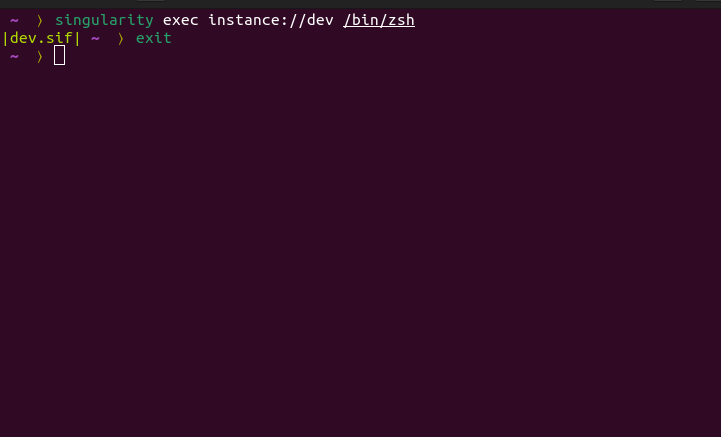

# zsh-singularityenv

Plugin provides `singularityenv_prompt_info` function which returns the current singularity environment name.



## Installation

1. Download the plugin

	```
	git clone https://github.com/saravanabalagi/zsh-plugin-singularityenv $ZSH_CUSTOM/plugins/singularityenv
	```

1. Add to `plugins` in `.zshrc` file

	```
	plugins=(
		...
		singularityenv
	)
	```

Then launch a new terminal or source `.zshrc` in your current terminal.

## Usage

This plugin exposes:

- `singularityenv_prompt_info` function based on two env vars
	1. `ZSH_THEME_SINGULARITYENV_PREFIX` default `(`
	1. `ZSH_THEME_SINGULARITYENV_SUFFIX` default `)`

Using this you can build a theme as below:

```zsh
base_prompt=PROMPT
PROMPT=$(singularityenv_prompt_info)"$base_prompt"

ZSH_THEME_SINGULARITYENV_PREFIX="%{$fg[blue]%}("
ZSH_THEME_SINGULARITYENV_SUFFIX=")%{$reset_color%}"
```

## License

Please refer to the [License](LICENSE) file.
